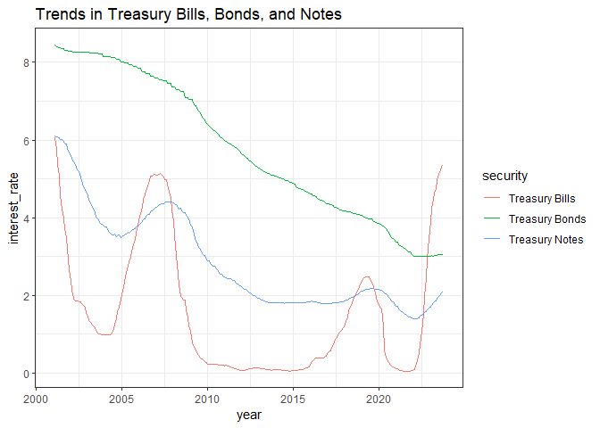
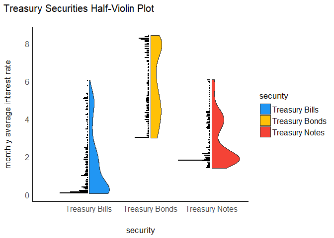
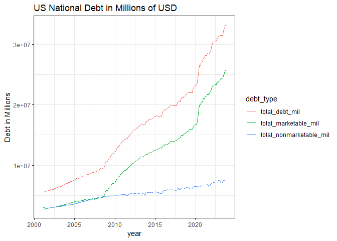
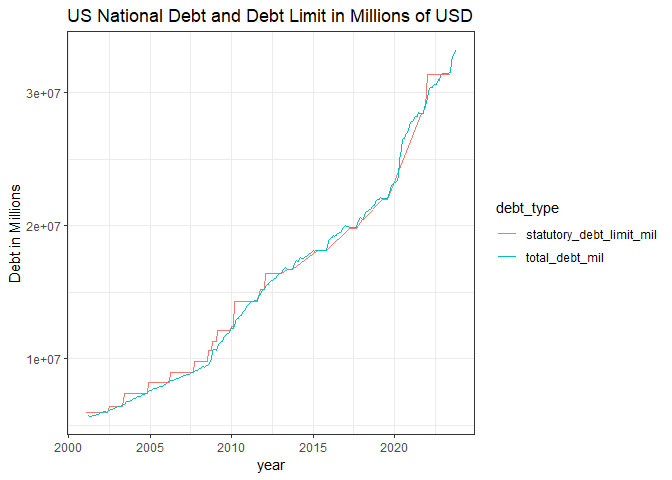
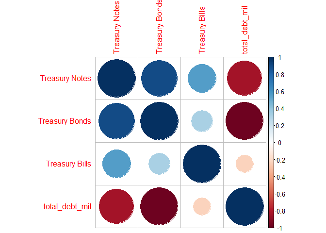

Vignette about contacting US Treasury API
================
Sarat Bantupalli
October 10, 2023

This project creates a vignette to contact an API using functions to
query, parse, and return well-structured data. I demonstrated it by
connecting to the publicly available fiscal data from the [US Federal
Treasury](https://fiscaldata.treasury.gov/api-documentation/). The data
is open source and does not require an API key to access it.

I have built few functions to interact with some of the endpoints in the
API, extract the data and perform exploratory data analysis. Through
this project I want to see trends in monthly rates of treasury
securities (example- Treasury Bonds), since these are considered to be
safe havens for investments. I also want to see the trends in national
debt.

# Required Packages

We need the following packages to connect to the API, retrieve the data,
and summarize it.

- `tidyverse`: for data manipulation and plotting  
- `httr`: to connect to the API and obtain the data in JSON format  
- `jsonlite`: to parse data obtained in JSON data format  
- `lubridate` : to work with datetime type data objects  
- `corrplot`: to create a visual of correlations
- `see` : to plot distribution of Treasury Securities

``` r
library(tidyverse)
library(httr)
library(jsonlite)
library(lubridate)
library(corrplot)
library(see)
```

# API structure

The API has a well written documentation that describes how to access
different data sets. Based on this documentation, the components that
make up a full valid API request include:

- Base URL, which is constant across all API URLs  
- Endpoint  
- Parameters and Filters (optional)

## Base URL

The base URL for all APIs is constant.

`https://api.fiscaldata.treasury.gov/services/api/fiscal_service/`

## Endpoints

List of all available data sets can be found on the [Treasury
website](https://fiscaldata.treasury.gov/datasets/). This page
summarizes how to obtain data from the endpoint of interest. The
endpoints that were considered for the project:

- *average interest rate on US Treasury securities*: monthly interest
  rates in different treasury securities including bonds and notes  
- *public debt and debt limit*: monthly statement of how much the
  country owes and how close is it to the debt limit

## Parameters and Filters

This is optional part of the API URL to filter data.

Although this part of the API URL is optional, I had an issue with the
number of observations I could pull from the API. *By default, the API
limits 100 observations of data to be exchanged*. To get around this
issue the *pagination* option for the API URL was set to 10000. It gives
me a great reflection that *each API is unique*.

# API Interaction Functions

## Monthly Average Interest Rate

For this part a function was created, `avg_interest`, that queries the
*Average Interest Rates on U.S. Treasury Securities* API. There are 2
broad categories of US securities: marketable and non-marketable.
*Marketable* securities are the ones that the public can purchase on the
open market and might be of interest as an individual. Personally, I am
interested in these type of securities as a safe bet for investing. By
creating this function, I wanted to see the monthly trends in marketable
securities.

Using this function, the user can customize their query to include any
of the following 7 types of marketable securities: Treasury Bills,
Treasury Notes, Treasury Bonds, Treasury Inflation-Protected Securities
(TIPS), Treasury Floating Rate Notes (FRN), Federal Financing Bank, and
Total Marketable. The default type of security is *all*, where the
function outputs average interest rates for all marketable securities.

``` r
avg_interest <- function(security_class = "all") {
  # Here we are joining different parts of the API URL we are interested in.
  # The base URL for queries in the API is constant.
  base_url <- "https://api.fiscaldata.treasury.gov/services/api/fiscal_service/"
  # The Endpoint of the average interest rates API
  api_endpoint <- "v2/accounting/od/avg_interest_rates"
  # Optional Pagination field
  pagination_data <- "?page[number]=1&page[size]=10000"
  # Here the complete URL for API was constructed by pasting the base_url and api_endpoint url
  output_url <- paste0(base_url,api_endpoint,pagination_data)
  #The GET function from httr package was used to connect to the API and get the data 
  raw_data <- GET(output_url)
  # The raw data in JSON format is converted to a data frame in these 2 steps
  parsed_data <- fromJSON(rawToChar(raw_data$content))
  parsed_data <- data.frame((parsed_data$data))
  # # Their are certain observations that have a value "null". The rows with value "null" are removed then 
  # the data is filtered to only save the securities which are Marketable
  parsed_data <- parsed_data %>% filter(avg_interest_rate_amt != "null") %>% 
    filter(security_type_desc == "Marketable") %>%
    select(date = record_date, security = security_desc, 
           avg_interest = avg_interest_rate_amt, year = record_calendar_year)
  
  # Filtering data based on the type of security chosen by the user
  # If the user specified security_class is not equal to "all", the function returns data with the specified security_type
  if(security_class != "all") {
    parsed_data <- parsed_data %>% filter(security == security_class)
  }
  # If user specified security_type is "all", no filtering of data is done
  else {
    
  }
  
  # Converting the output to a tibble type
  parsed_data <- tibble(parsed_data)
  # Converting the output type for different parameters
  # Converting the date from character type to date using the lubridate package
  parsed_data$date <- ymd(parsed_data$date)
  # Converting the avg_interest parameter into a numeric
  parsed_data$avg_interest <- as.numeric(parsed_data$avg_interest)
  parsed_data$year <- as.numeric(parsed_data$year)
  return(parsed_data)
}
```

As an example, I have queried the data for the monthly average interest
rates for Treasury Bonds

``` r
avg_interest(security_class =  "Treasury Bonds")
```

    ## # A tibble: 273 × 4
    ##    date       security       avg_interest  year
    ##    <date>     <chr>                 <dbl> <dbl>
    ##  1 2001-01-31 Treasury Bonds         8.45  2001
    ##  2 2001-02-28 Treasury Bonds         8.39  2001
    ##  3 2001-03-31 Treasury Bonds         8.39  2001
    ##  4 2001-04-30 Treasury Bonds         8.38  2001
    ##  5 2001-05-31 Treasury Bonds         8.37  2001
    ##  6 2001-06-30 Treasury Bonds         8.36  2001
    ##  7 2001-07-31 Treasury Bonds         8.36  2001
    ##  8 2001-08-31 Treasury Bonds         8.32  2001
    ##  9 2001-09-30 Treasury Bonds         8.32  2001
    ## 10 2001-10-31 Treasury Bonds         8.31  2001
    ## # ℹ 263 more rows

## Monthly National Public Debt and Monthly Statutory Debt Limit Statement

For this part a function was created, `debt_and_debt_limit`, that
queries two APIs: *U.S. Treasury Monthly Statement of the Public Debt
(MSPD) - Summary of Treasury Securities Outstanding* and *U.S. Treasury
Monthly Statement of the Public Debt (MSPD) - Statutory Debt Limit*. The
function gives the user monthly data on the type of debt the country has
and how close the finances are to the debt limit set by congress.

The first API has data relevant to the type of debt the country is
carrying over each month. From it the user can customize their query to
include the following options:

- security_type : `Total Marketable`, `Total Nonmarketable`,
  `Total Public Debt Outstanding`. The default is “all”, where the
  function outputs total debt for all these types.  
- year_from: the user can choose the start range of year they want the
  data for. The default start is 2001  
- year_to: the user can choose the end range of year they want the data
  for. The default end year is 2023

The second API has data relevant to the statutory debt limit set by
congress. From it the user has the option to choose following options:

- debt_type : `Statutory Debt Limit`, and
  `Balance of Statutory Debt Limit`  
- year_from: the user can choose the start range of year they want the
  data for. The default start is 2001  
- year_to: the user can choose the end range of year they want the data
  for. The default end year is 2023

Please note, the *treasury summary data exists only from January 2001 to
September 2023*. Year ranges outside these limits will throw an error.

``` r
debt_and_debt_limit <- function(security_type = "all", year_from = 2001, year_to = 2023, debt_type = "all"){
  # The base URL for queries in the API is constant.
  base_url <- "https://api.fiscaldata.treasury.gov/services/api/fiscal_service/"
  # The Endpoint of the monthly public debt
  debt_api_endpoint <- "v1/debt/mspd/mspd_table_1"  
  # The Endpoint of the average monthly interest rate on the public debt
  limit_on_debt_api_endpoint <- "v1/debt/mspd/mspd_table_2"
  
  # Optional Pagination field
  pagination_data <- "?page[number]=1&page[size]=10000"
  
  # Here the complete URL for monthly public debt API was constructed by pasting the base_url and api_endpoint url
  debt_api_url <- paste0(base_url,debt_api_endpoint,pagination_data)
  # Here the complete URL for monthly interest rate on public debt API was constructed by pasting the base_url and api_endpoint url
  limit_on_debt_api_url <- paste0(base_url,limit_on_debt_api_endpoint,pagination_data)
  
  #The GET function from httr package was used to connect to both the APIs and get the data 
  # Public debt data
  debt_raw_data <- GET(debt_api_url)
  # Interest Rate on Public Debt
  limit_on_debt_raw_data <- GET(limit_on_debt_api_url)
  
  
  # The raw debt data in JSON format is converted to a data frame in these 2 steps
  debt_parsed_data <- fromJSON(rawToChar(debt_raw_data$content))
  debt_parsed_data <- data.frame((debt_parsed_data$data))
  
  # # Here the Public Debt data was manipulated to select the parameters we are interested in analyzing
  # The data is then filtered to save the observations for Total Marketable, Total Nonmarketable, and Total Public Debt Outstanding
  debt_parsed_data <- debt_parsed_data %>%
    select(date = record_date, security = security_type_desc, 
           debt_millions = total_mil_amt, 
           year = record_calendar_year) %>% 
    filter(security == "Total Marketable" | 
             security == "Total Nonmarketable" |
             security == "Total Public Debt Outstanding")
  
  # Filtering data based on user requested range of years
  debt_parsed_data <- debt_parsed_data %>% 
    filter(year >= year_from & year <= year_to) %>% 
    select(date, security, debt_millions)
  
  # Converting data into numeric
  debt_parsed_data$debt_millions <- as.numeric(debt_parsed_data$debt_millions)
  
  # Filtering data based on the type of security chosen by the user
  # If the user specified security_class is not equal to "all", the function returns data with the specified security_type
  if(security_type != "all") {
    debt_parsed_data <- debt_parsed_data %>% 
      filter(security == security_type)
  }
  # If user specified security_type is "all", no filtering of data is done
  else {
    
  }
  
  #Changing format of the data frame from long to wide
  debt_parsed_data <- debt_parsed_data %>% 
    pivot_wider(names_from = "security", values_from = "debt_millions")
  
  # The raw debt limit data in JSON format is converted to a data frame in these 2 steps
  limit_on_debt_parsed_data <- fromJSON(rawToChar( limit_on_debt_raw_data$content))
  limit_on_debt_parsed_data <- data.frame((limit_on_debt_parsed_data$data))
  
  # # Here the Debt limit data was manipulated to select the parameters we are interested in analyzing
  # The data is then filtered to save the observations for Statutory Debt Limit,
  # and Balance of Statutory Debt Limit
  limit_on_debt_parsed_data <- limit_on_debt_parsed_data %>% 
    select(date = record_date, 
           type_of_debt = debt_limit_class1_desc, 
           debt_limit_millions = total_mil_amt,
           year = record_calendar_year) %>% 
    filter(type_of_debt == "Statutory Debt Limit" | 
             type_of_debt == "Balance of Statutory Debt Limit" )

    # Filtering data based on user requested range ofyears
  limit_on_debt_parsed_data <- limit_on_debt_parsed_data %>% 
    filter(year >= year_from & year <= year_to) %>% 
    select(date, type_of_debt, debt_limit_millions)
  # Convert to numeric data
  limit_on_debt_parsed_data$debt_limit_millions <- as.numeric(limit_on_debt_parsed_data$debt_limit_millions)
  
  # Filtering data based on the type of security chosen by the user
  # If the user specified security_class is not equal to "all", the function returns data with the specified security_type
  if(debt_type != "all") {
    limit_on_debt_parsed_data <- limit_on_debt_parsed_data %>% 
      filter(type_of_debt == debt_type)
  }
  # If user specified security_type is "all", no filtering of data is done
  else {
    
  }
  
  #Changing format of the data frame from long to wide
  limit_on_debt_parsed_data <- limit_on_debt_parsed_data %>% 
    pivot_wider(names_from = "type_of_debt", values_from = "debt_limit_millions")
  
  # We are combining data from the 2 APIs here into a single data frame using the inner_join function
  combined_data <- inner_join(debt_parsed_data, limit_on_debt_parsed_data)
  
  # Changing Column names of the output
  colnames(combined_data) <- c("date", "total_marketable_mil", 
                               "total_nonmarketable_mil", "total_debt_mil",
                               "statutory_debt_limit_mil", "balance_of_statutory_debt_limit_mil")

  # Converting the output type for different parameters
  # Converting the date from character type to date using the lubridate package
  combined_data$date <- ymd(combined_data$date)
  
  return(combined_data)
}
```

As an example, I have queried the data for the monthly average interest
rates for Treasury Bonds

``` r
debt_and_debt_limit(security_type = "Total Public Debt Outstanding", 
                    year_from = 2002, year_to = 2012,
                    debt_type = "Balance of Statutory Debt Limit")
```

    ## # A tibble: 132 × 3
    ##    date       total_marketable_mil total_nonmarketable_mil
    ##    <date>                    <dbl>                   <dbl>
    ##  1 2002-01-31             5937229.                 84108. 
    ##  2 2002-02-28             6003453.                 16846. 
    ##  3 2002-03-31             6006032.                 14892. 
    ##  4 2002-04-30             5984677.                 35184. 
    ##  5 2002-05-31             6019332.                    24.9
    ##  6 2002-06-30             6126469.                341687. 
    ##  7 2002-07-31             6159741.                307950. 
    ##  8 2002-08-31             6210482.                257165. 
    ##  9 2002-09-30             6228236.                238569. 
    ## 10 2002-10-31             6282528.                168716. 
    ## # ℹ 122 more rows

# Exploratory Data Analysis

## Questions

The questions I am interested in from the US Treasury Fiscal data are:

- *trends in treasury securities*  
- *trends in national debt*

## Treasury Securities

In this part, I tried to answer the question of *trends in treasury
securities*. As an individual investor, I am interested in Treasury
Notes, Bills, and Bonds.

### Data and API Call

Here the API data was accessed using the `avg_interest` function and
stored in the R object *treasury_securities_data*.

``` r
treasury_securities_data <- avg_interest(security_class =  "all")
```

### Summary for Treasury Bills, Bonds, and Notes

Using the `group_by()` function, to find the summary yields from Bills,
Bonds, and Notes from 2001 through 2023.

``` r
treasury_securities_data %>% 
  filter(security == "Treasury Bills" | 
          security == "Treasury Bonds" | 
           security == "Treasury Notes") %>% 
  group_by(security) %>% 
  summarise(avg = mean(avg_interest), sd = sd(avg_interest), 
            min = min(avg_interest), max = max(avg_interest))
```

    ## # A tibble: 3 × 5
    ##   security         avg    sd   min   max
    ##   <chr>          <dbl> <dbl> <dbl> <dbl>
    ## 1 Treasury Bills  1.57  1.67 0.045  6.06
    ## 2 Treasury Bonds  5.76  1.83 3.00   8.45
    ## 3 Treasury Notes  2.85  1.25 1.40   6.10

On average, from 2001 through 2023, Treasury Bonds earned the highest
monthly interest at **5.8 %**. The Treasury Notes earned a descent **2.9
%** on average while Treasury Bills earned **1.6 %**. The minimum
interest rates for the Treasury Bills is the lowest among the three
while Treasury Bonds have the highest maximum.

### Tables for Treasury Bills, Bonds, and Notes

The Federal Reserves target inflation is 2% year over year. In this
section I want to determine the number of times investments in Treasury
Securities will have a return lower than the Fed’s target. Essentially I
want to know the number of times my money is losing its value compared
to inflation.

First the data is filtered for observations with monthly interest less
than 2%. Then the data is grouped based on year of data and type of
security. This was done to calculate average interest for each security
per year. Since the Federal Reserve traget of inflation is per year,
this step is necessary for comparison. A contingency table was then
created to summarize this data.

``` r
securities_less_than_inflation_data <- treasury_securities_data %>% 
  filter(security == "Treasury Bills" | 
          security == "Treasury Bonds" | 
           security == "Treasury Notes") %>% 
  filter(avg_interest <= 2)
# Calculate average interest rate per year
securities_less_than_inflation_data <- securities_less_than_inflation_data %>% 
  group_by(year, security) %>% 
  summarise(annual_avg_interest = mean(avg_interest))
#Contingency table
table(securities_less_than_inflation_data$security)
```

    ## 
    ## Treasury Bills Treasury Notes 
    ##             18             11

The results show that in the past 23 years (2001 through 2023), *18
times Treasury Bills yielded less than the target* inflation rate of 2%
while *Treasury Notes yielded 11 less than the Federal Reserve target*.
On contrary, *Treasury Bonds always had a return greater than 2%* for
the past 23 years. This makes them the best investment among the
Treasuries of interest.

### Plots for Treasury Bills, Bonds, and Notes

Here the trends of the 3 types of marketable securities; Bills, Bonds,
and Notes, are plotted using the `ggplot` package. The data was
initially filtered and then plotted.

``` r
g1 <- treasury_securities_data %>% 
  filter(security == "Treasury Bills" | 
          security == "Treasury Bonds" | 
           security == "Treasury Notes") %>% 
  ggplot(aes(x = date, y = avg_interest)) + geom_line(aes(color = security)) + 
  labs(x = "year", title = "Trends in Treasury Bills, Bonds, and Notes", y = "interest_rate") +
  theme_bw()
g1
```

<!-- -->

From the plot it can be seen that if you are a *long term investor
Treasury Bonds* are the best bet followed by Treasury Notes.
Interestingly the Treasury Bills have a tendency to go up during
recessions. This can be seen in 2002, 2008, and 2023(not sure if 2023 is
a recession). So if you are a short term investor, *buying Treasury
Bills in an economic downturn* might be the best case.

Also in the average monthly interest on Treasury Bonds has been
decreasing over the years. The reason could be combination of demand and
monetary policy.

Below, I have created a visual of a half-violin half-dot plot using the
`see` library. It gives a better visual of the distribution and the
sample size of Treasury Securities at the same time.

``` r
treasury_securities_data %>% 
  filter(security == "Treasury Bills" | 
          security == "Treasury Bonds" | 
           security == "Treasury Notes") %>% 
  ggplot(aes(x =  security  , y = avg_interest, fill = security)) +
  geom_violindot(fill_dots = "black") +
  theme_modern() + scale_fill_material_d() + 
  labs(y = "monthly average interest rate", title = "Treasury Securities Half-Violin Plot")
```

<!-- -->

The plot above gives a distribution of the three Treasury Securities we
are interested in. We can see the Treasury Bills have a higher
concentration of interest rates on the lower side. The trend is same for
Treasury Notes too. But the the distribution for Treasury Bonds is more
balanced, where the interest rate distribution are equal to the lower
side and upper side. This plot gives me more confidence to invest in
Treasury Bonds where historically we have better average interest rates.

### Treasury Securities Conclusions

The average monthly yields from Treasury Bonds in the past 2 decades is
5.8%, while 2.8% from Notes and 1.6% from Bills. Although Treasury Bills
have low average yields over the time period, they tend to have high
monthly yields during economic downturns.

## National Debt and National Debt Limit

In this part, I tried to answer the question of *trends in national debt
and national debt limit*. These trends will give an idea of deficit the
country is facing.

Here the API data was accessed using the `debt_and_debt_limit` function
and stored it in the R object *debt_data*.

``` r
debt_data <- debt_and_debt_limit()
# Data was formatted into long format here
debt_data_long <- debt_data %>% pivot_longer(cols = 2:6, names_to = "debt_type", values_to = "debt_millions") %>% drop_na
```

### National Debt

Here I try to visualize the national debt trend over the years. I
plotted the trends in total public debt, total debt in marketable
securities, and total debt in non-marketable securities.

``` r
debt_data_long %>% filter(debt_type == "total_marketable_mil" |
                            debt_type == "total_nonmarketable_mil" |
                            debt_type == "total_debt_mil") %>%
  ggplot(aes(x = date, y = debt_millions, color = debt_type)) + 
  geom_line() + labs(x = "year", title = "US National Debt in Millions of USD",
                     y = "Debt in Millions") + theme_bw()
```

<!-- -->

The national debt has steep curves after 2008 and 2020. Both these times
represent economic downturns (2008 recession and 2020 pandemic induced
recession). This signifies an increase in spending by the government.
Interestingly the marketable debt tracks the trend close to national
debt whereas the non-marketable debt has more or less been similar.

### National debt vs Debt Limit

Here I tried to take a look at a comparison of national debt and
statutory debt limit set by congress. I wanted to see if its always been
the case that congress waits to increase the debt limit or they have
been proactive in the past.

``` r
debt_data_long %>% filter(debt_type == "total_debt_mil" |
                            debt_type == "statutory_debt_limit_mil") %>%
  filter_if(is.numeric, all_vars((.) != 0)) %>% #Values with 0 were removed here
  ggplot(aes(x = date, y = debt_millions, color = debt_type)) + 
  geom_line() + labs(x = "year", title = "US National Debt and Debt Limit in Millions of USD",
                     y = "Debt in Millions") + theme_bw()
```

<!-- -->

Interestingly the plot looks like a cumulative density function. For
certain months the value of statutory debt limit was reported as 0.
These values were removed using `filter_if` function. The reason for
these data gaps is unknown. We can see the national debt has been
creeping up.

### Correlation between National Debt and Interest on Treasury Securities

I wanted to to see if their is any correlation between the national debt
and the interest rates on marketable treasury securities. I created a
visual of the correlation matrix using the `corrplot` library.

``` r
# Convert the securities data into wide format and select the columns we are interested in
securities_data_wide <- treasury_securities_data %>% 
  select(date, security, avg_interest) %>% 
  pivot_wider(names_from = security, values_from = avg_interest) %>% 
  select(date, `Treasury Notes`, `Treasury Bonds`, `Treasury Bills`)
# Add total national debt to securities data
securities_data_wide$total_debt_mil <- debt_data$total_debt_mil
securities_data_wide <- securities_data_wide %>% drop_na()

# Correlation matrix between all of the numeric variables.
numeric_securities_data <- securities_data_wide %>% select(where(is.numeric)) 
Correlation <- cor(numeric_securities_data)

#A graphical summary of the correlation matrix was created using the corrplot library.
corrplot(Correlation,  tl.pos = "lt")
```

<!-- -->

From the plot we can see that the total national debt has a *strong
negative correlation with Treasury Bonds*. The national debt also has a
*moderately strong negative correlation with Treasury Notes*. The plot
also suggests that the Treasury Notes and Treasury Bonds have strong
positive correlation.

### National Debt and National Debt Limit Conclusion

The current national debt is close to \$33 trillion and is inching up.
Interesting there is close negative correlation between Treasury Bonds/
Notes and National Debt. Most of the national debt is in the marketable
securities, treasury securities that can be purchased on the open
financial markets by individuals and institutions.
